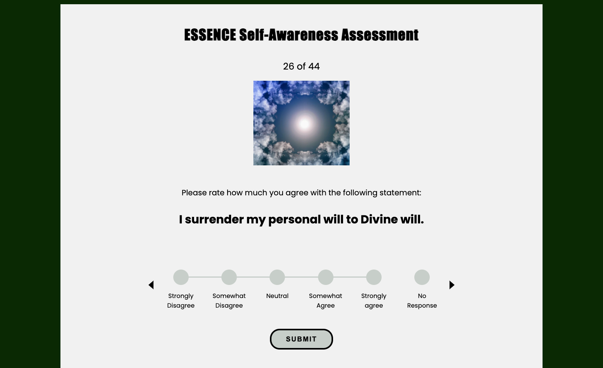
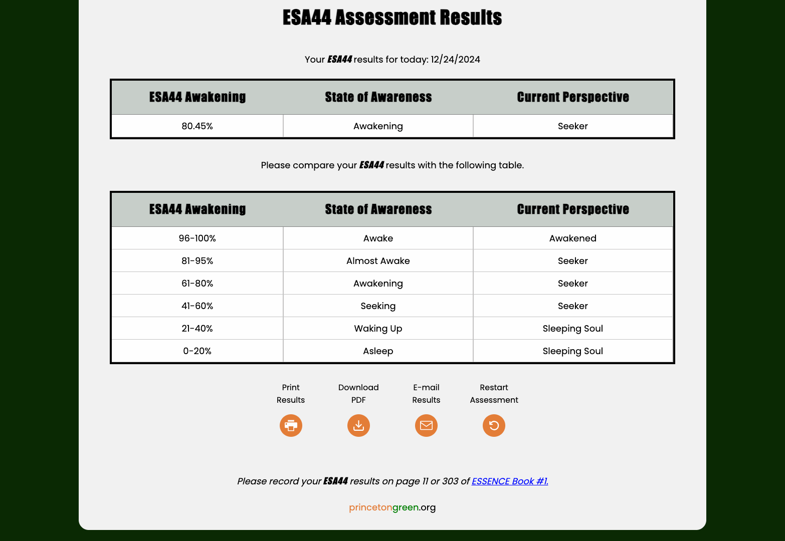
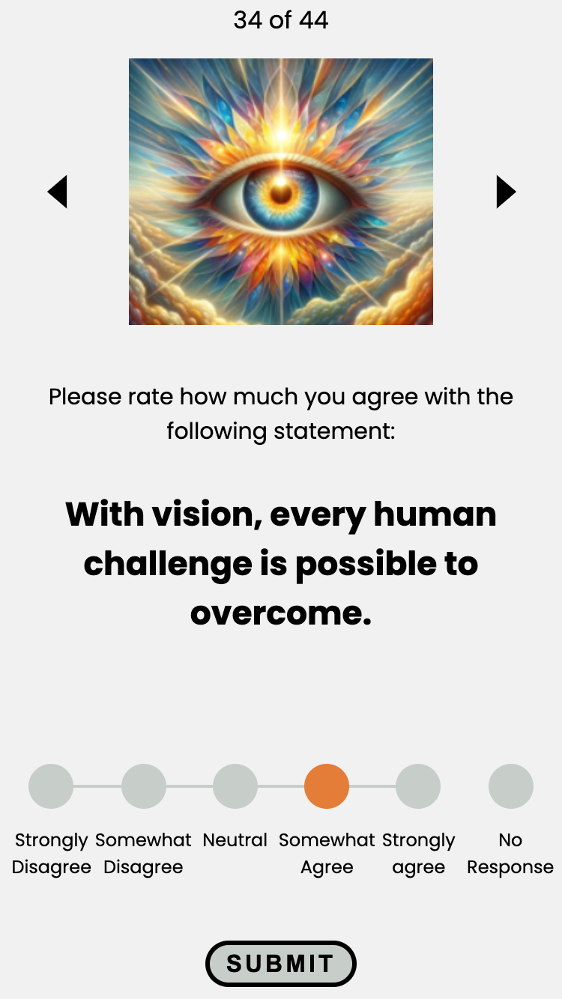
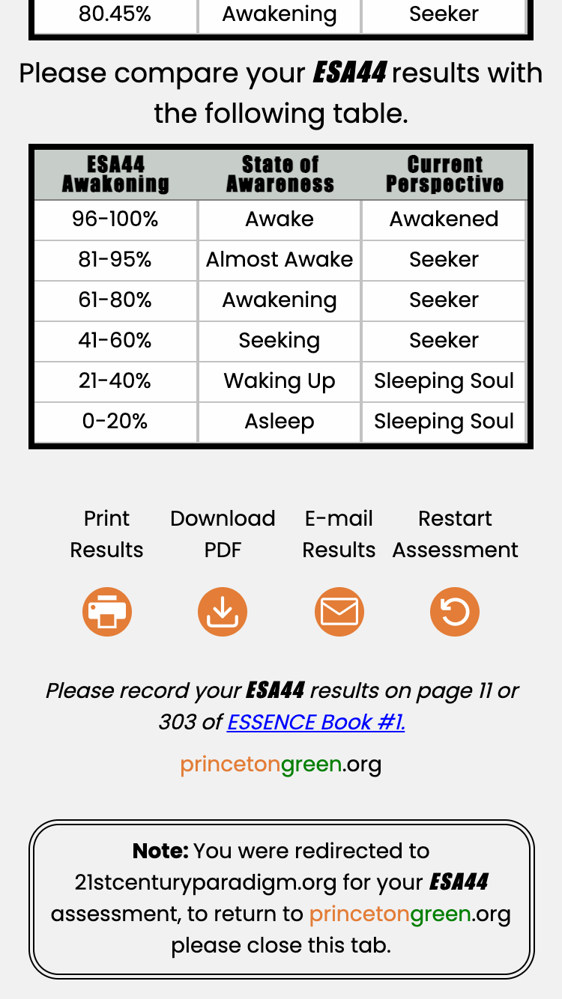

# Essence

##### Link to [Essence](https://saidou25.github.io/essence/).

---

### Description

Essence is an assessment application designed to enhance self-awareness through a 44-aspect evaluation. Users rate themselves on a 1 to 5 scale, with an optional "No Response" (0 points). The assessment calculates a percentage of awakening based on the responses, with results categorized as Sleeping, Seeking, or Awake.

Key Features:

- One-question-at-a-time format: Users answer one question at a time, with navigation restrictions to ensure focus.
- Editable responses: Users can edit their responses both before and after submission when navigating to any previously rated aspect.
- Result options: Users can:
    - Print their results.
    - Download their results as a PDF.
    - Users can take the assessment as many times as they want by pressing the restart button.
- Users can opt to email their results after computation. (no registration required).
- No account required to take the assessment.

The full website is available at [princetongreen.org](https://princetongreen.org). To access the 'Essence' application, navigate to 'Free Resources' and select 'ESSENCE Assessments' then press 'TAKE THE ESA44  ASSESSMENT FOR FREE'.

### Requirements

I'm building a new website (screenshot above), hosted on Hostinger, and am seeking to have an online assessment built, which users can take for free.

It's called the ESSENCE Self-awareness (ESA44) assessment. It involves rating one Self based on 44 Aspects of ourselves.

Each Aspect will have a statement, and the user will rate themselves in relation to the Aspect, on a 1 to 5 scale, where 1 is "I strongly disagree with the statement" and 5 is "I strongly agree with the statement." At the far right, beyond the 1 to 5 scale, have a No Response option, which counts as 0 points.

The assessment tallies all of the responses, so with 44 Aspects x 5 potential points for each, there is a maximum of 220 points in all (44x5). The total score is calculated, and divided by 44, to give a % of awakening score.

So if one person gives a 5 to all 44 Aspects, then their score is 220, and 220/220 is % of awakening is 100%, and they are wide wake. If another person gives a 1 to all 44 Aspects, then their score is 44, and their awakening is 20%, which means they are vastly asleep. If a 3rd person gives a varied response throughout, then the % of awakening is somewhere in between.

So it basically is straightforward math. Add up to the total of responses, and divide that total by 220 potential points to arrive at a % of awakening, and then compare the % to a table which indicates whether someone is sleeping (low %), seeking (mid %), or awake (high %).

Also, I want each Aspect statement to appear one at a time, and not having in a list format. They can't go onto the next item until they respond to the current item.

Also, have so the user can go back and change, and they can go forward, but not beyond the current statement.

People DO NOT have to register to take the ESA44 assessment. I do want them to have the option to have their results of their assessment emailed to them, if they so choose. This option should occur once the results of the assessment are computed and shown on the screen. Therefore, people DO have to register to have their results emailed to them. And people DO have to register to join our email list.

## Table of Contents

- [Technologies](#technologies)
- [Installation](#installation)
- [Visuals](#visuals)
- [Testing](#testing)
- [Contributing](#contributing)
- [Future development](#future-development)
- [Questions](#questions)

## Technologies

`Vite`, `React`, `Node.js`, `Firebase`, `Sendgrid/mail`,`Jest`, `Eslint`, `HTML2PDF`

## Installation

Clone the repository.
`npm install` then :

- At the root of the project in the cli type: `firebase emulators:start --only`: functions starts the server(backend).
- cd/client: `npm run develop` starts the client(frontend).

## Visuals

- Assessment layout

- Results layout

- Assessment on mobile view

- Results on mobile view

## Testing

This project employs:

- `eslint` for code linting.
- `jest` for unit and integration testing.
- `Performance`, `profiler` using browser dev tools.
- `Lighthouse` for accessibility, performance, and SEO checks.

## Future development

The project includes plans for two additional assessments, with features to track user results and provide actionable insights.

## Contributing

Special thanks to Stack Overflow, its contributors, Google, and ChatGPT for their valuable resources and troubleshooting support.

## Questions

If you have any questions or wish to contact me please follow the link to my profile [Sy25](https://github.com/Saidou25).
